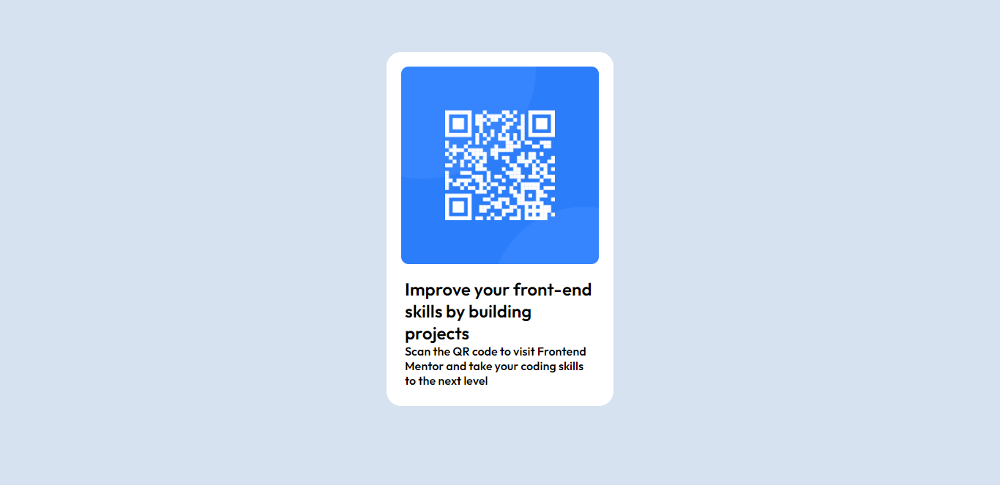

# Frontend Mentor - QR code component solution

This is a solution to the [QR code component challenge on Frontend Mentor](https://www.frontendmentor.io/challenges/qr-code-component-iux_sIO_H). Frontend Mentor challenges help you improve your coding skills by building realistic projects. 

### Screenshot
#### Desktop Preview

#### Mobile Preview

### Links

- Solution URL: [code](https://github.com/chatrapathi-002/Frontend-Mentor-Challenges/tree/main/qr-code-component)
- Live Site URL: [live](https://your-live-site-url.com)

## My process

### Built with

- Semantic HTML5 markup
- CSS custom properties
- CSS Grid

